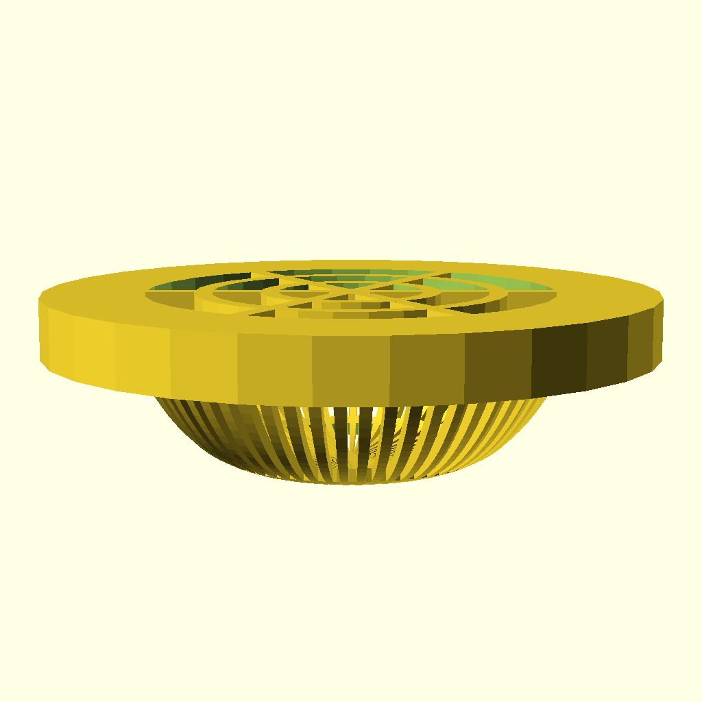

# 排水口カバー


家の排水溝用の3Dデータ(scadコード)

## memo
### 画像を出力するのに使ったコマンド
```sh
openscad -o drain-cover.png --imgsize 1024,1024 --camera 0,-290,60,0,0,0 drain-cover.scad
```

### stlを出力するのに使ったコマンド
```sh
openscad -o drain-cover.stl drain-cover.scad
```
